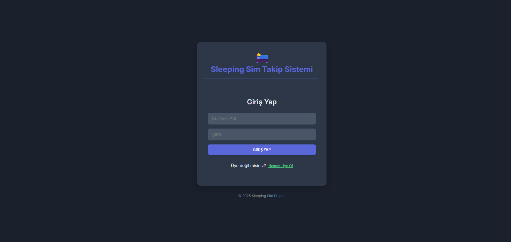
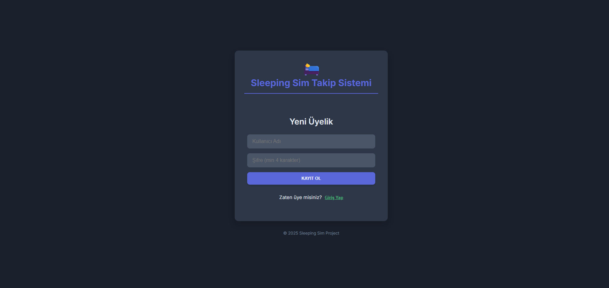
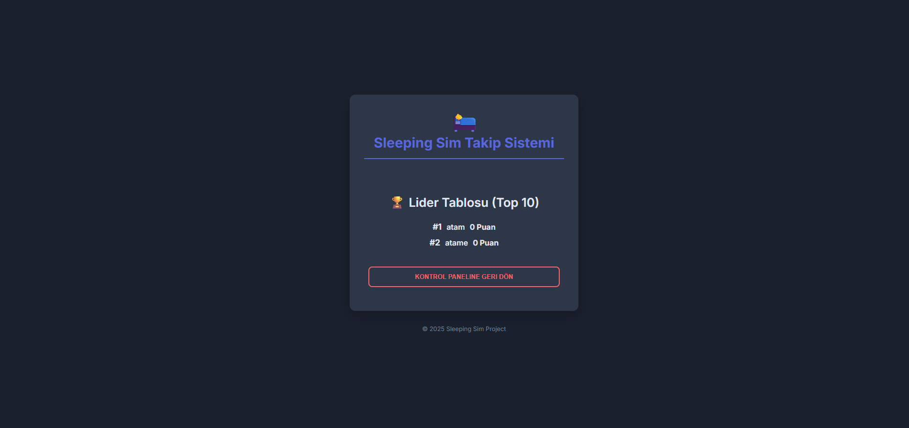
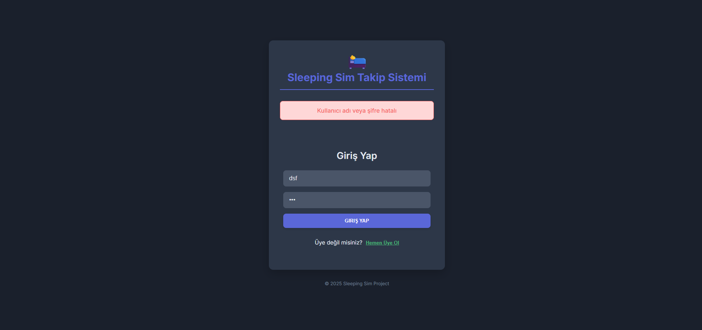

# 😴 Sleeping Sim: AI-Powered Sleep Tracker & Gamification


## 📖 Overview
**Sleeping Sim** is an innovative web application that gamifies healthy sleep habits. By leveraging Computer Vision (AI), the system monitors the user's sleep patterns in real-time, calculates a "Sleep Score," and allows users to compete on a global leaderboard.

The project features a modern **Dark Mode** interface and a robust microservices architecture connecting Python AI, Java Backend, and React Frontend.

## 🚀 Features
* **AI Sleep Tracking:** Uses YOLO & OpenCV to detect sleeping posture and duration.
* **Live Scoring:** Calculates sleep score automatically (updates every 5 seconds via Python client).
* **Leaderboard:** Top 10 users are displayed based on their sleep scores.
* **User System:** Secure authentication (Login/Register) with error handling.
* **Modern UI:** User-friendly Dark Mode interface.


 **IMPORANT:** User ids are not dynamic for now. You have to change it manually in sleeping_sim_training/main.py. It will be fixed soon.

## 📸 Screenshots

| User Login | Create Account |
|:---:|:---:|
|  |  |
| *Secure Login Screen* | *New User Registration* |

| Dashboard & Score | Leaderboard |
|:---:|:---:|
|  |  |
| *Real-time Sleep Score Panel* | *Global Top 10 Rankings* |

| Error Handling |
|:---:|
|  |
| *Validation Feedback* |

## 🛠️ Installation & Setup

### Prerequisites
* Java JDK 17+
* Node.js & npm
* Python 3.8+ (For AI Module)
* PostgreSQL Database

### 1. Clone the Repository

```bash
git clone https://github.com/atamertcan/sleepingsim.git
cd sleepingsim
```
### 2. Database Setup
Create a PostgreSQL database for the project.

1. Open pgAdmin or terminal.
2. Create a database named `sleepingsim`

### 3. Backend Setup (Spring Boot)
Navigate to the backend folder.

**Important:** Update database credentials before running.

1. Open `src/main/resources/application.properties`.
2. Update `spring.datasource.username` and `spring.datasource.password`.

Then run the application:

```bash
cd sleeping_sim_server
./mvnw spring-boot:run
```
### 4. Frontend Setup (React)
Navigate to the frontend folder.

```bash
cd ../sleeping_sim_client
npm install
npm run dev
```
### 5. AI Engine Setup (Python)
Navigate to the AI training/script folder. This script captures video and sends data to the backend.
**Note:** Ensure you have a working webcam connected.
```bash
cd ../Sleeping_sim_training
pip install ultralytics opencv-python requests
python main.py
```

